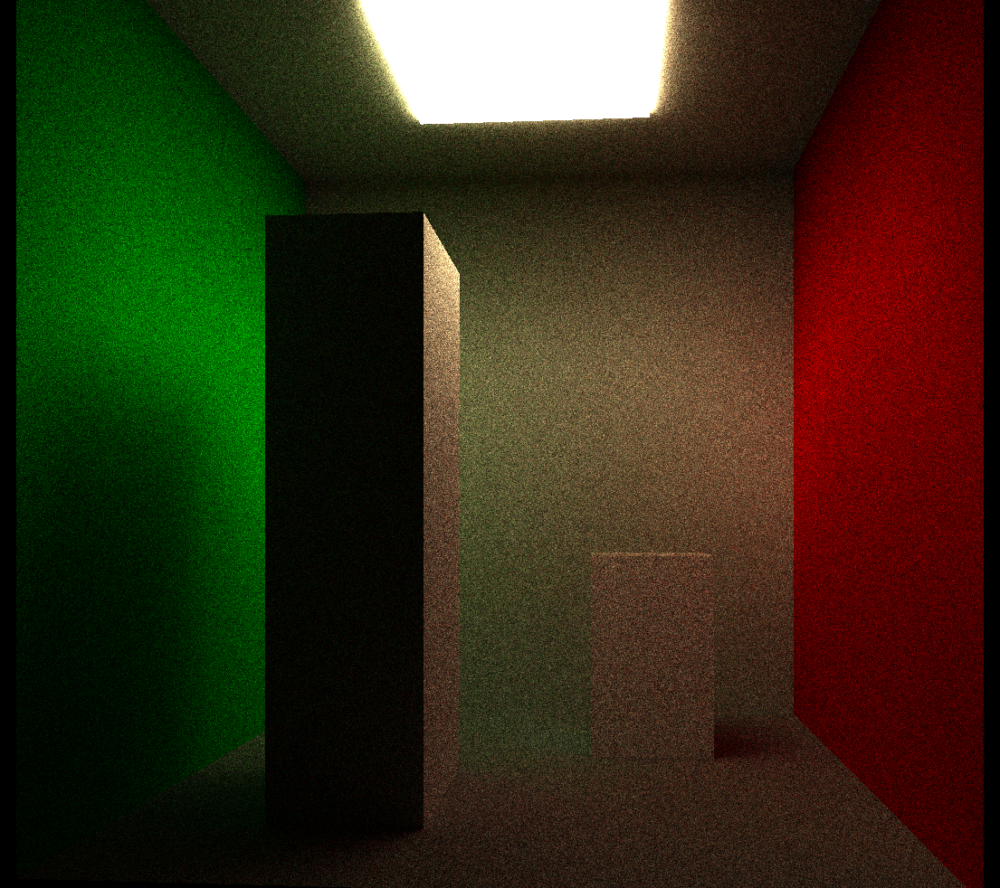

# raytracing_engine
This repo is just a raytracing project i made for learning, with gpu acceleration.

Its completely WIP so dont expect much as im working on it at a very slow pace (its also very messy it needs a refactor in a lot of parts and better doc).

The idea is also to not use AI for the project so i can trully learn the maths and all of that.

